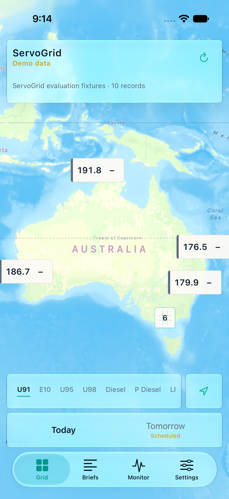

# ServoGrid

ServoGrid is a native, map-first iPhone app for inspecting Australian fuel-price evidence. It makes the trust state as visible as the price: live, scheduled, delayed, cached, unavailable, or explicitly synthetic demo data.



## What works

- Full-screen MapKit grid with reusable price annotations and real `MKClusterAnnotation` clustering.
- U91, E10, U95, U98, diesel, premium diesel, LPG, E85, and low-aromatic grade models.
- Separate source-effective, dataset-publication, first-observed, and last-checked timestamps.
- Local relative-price bands, station-to-station movement, deterministic regional briefs, source health, and anomaly monitoring.
- Explicit national demo dataset for repeatable evaluation.
- Public WA FuelWatch RSS adapter for today and tomorrow prices where the source publishes them.
- Credential-ready NSW and Tasmania FuelCheck adapter; secrets are read from Keychain and never stored in the repository.
- Honest unavailable/delayed adapters for jurisdictions where registration, permission, or verified reuse access is missing.
- Atomic versioned JSON cache, best-effort background refresh, and local alert orchestration.
- VoiceOver descriptions, Dynamic Type-friendly system typography, non-colour status cues, and 44-point controls.
- iOS 26+ Liquid Glass treatment behind availability checks, with a material treatment on iOS 17–25.

The app does not have an account, analytics SDK, advertising SDK, or server. Demo mode never silently replaces a failed live source.

## Run it

Requirements: Xcode 27, XcodeGen, and an installed iOS simulator runtime.

```sh
xcodegen generate
xcodebuild build-for-testing \
  -project ServoGrid.xcodeproj \
  -scheme ServoGrid \
  -destination 'platform=iOS Simulator,name=iPhone 17 Pro,OS=latest' \
  -derivedDataPath .build/DerivedData \
  CODE_SIGNING_ALLOWED=NO
xcodebuild test-without-building \
  -project ServoGrid.xcodeproj \
  -scheme ServoGrid \
  -destination 'platform=iOS Simulator,name=iPhone 17 Pro,OS=latest' \
  -derivedDataPath .build/DerivedData \
  CODE_SIGNING_ALLOWED=NO
```

Or open `ServoGrid.xcodeproj`, select an iPhone simulator, and run the `ServoGrid` scheme. `project.yml` is the source of truth for the generated Xcode project.

## Trust model

Every normalized observation carries provider identity, source URL, attribution, coverage mode, validity day, and independent timestamps. Freshness is calculated from provider-owned timestamps; a recent network check cannot make an old or undated price look fresh. Briefs require comparable station evidence, alerts are deterministic, and weak evidence yields “insufficient data” instead of invented insight.

See [data sources](docs/DATA_SOURCES.md), [architecture](docs/superpowers/specs/2026-08-30-servogrid-design.md), [evaluation](docs/EVALUATION.md), [privacy](PRIVACY.md), and [reproduction steps](docs/REPRODUCTION.md).

## Important limitations

- A clean checkout starts in explicit demo mode so the national experience is reproducible. WA can be selected in Settings for public live data.
- NSW and Tasmania need API.NSW production credentials and the applicable subscriber agreement.
- Other unavailable sources are shown as unavailable; ServoGrid does not scrape consumer websites or bypass registration.
- Local notifications depend on the user granting permission and on iOS giving the app foreground or background execution. ServoGrid cannot promise continuous closed-app monitoring without a server and remote push.
- The simulator evidence is not a physical-device usability study. The primary user-centred metric and study protocol are documented, but no participant result is claimed.
